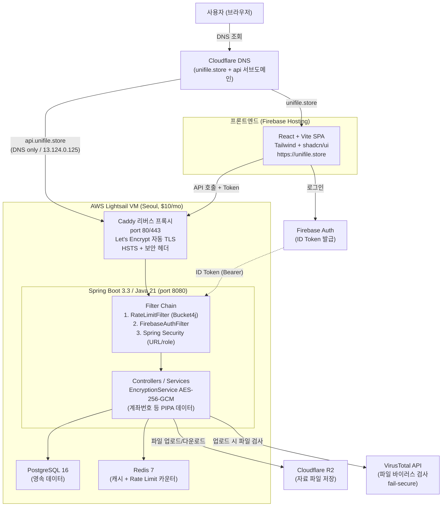

# UniFile 시스템 아키텍처

## 핵심 요약

| 영역 | 주요 기술/특징 |
|---|---|
| **프론트** | Firebase Hosting, React+Vite SPA, Tailwind |
| **DNS** | Cloudflare (api는 DNS only — Caddy로 직접) |
| **엣지** | Caddy 리버스 프록시, Let's Encrypt 자동 갱신 |
| **앱** | Spring Boot 3.3, 3-단계 Filter Chain |
| **인증** | Firebase Auth → ID Token → Spring 검증 (stateless) |
| **데이터** | Postgres (영속) + Redis (캐시·RateLimit) — 같은 docker network |
| **파일** | R2 (저장) + VirusTotal (검사, fail-secure) |
| **암호화** | 계좌번호 등 민감정보 AES-256-GCM (`ENCRYPTION_KEY` env) |
| **배포** | 단일 Lightsail VM, docker compose, $10/월 |
